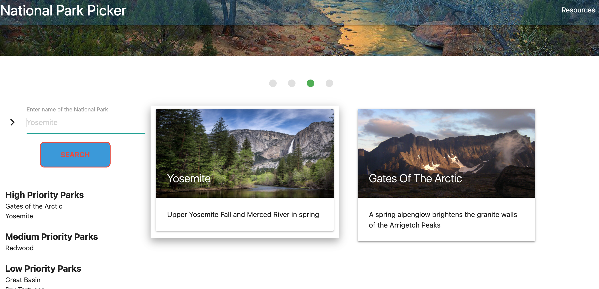

# national-park-picker
the best app you can find!

## Description

AS A fan of the outdoors and a lover of travel,

I WANT an app that shows me all the national parks with their most vital information

SO THAT I can plan a great vacation. 

National Park Picker is a platform made to explore and plan visits to National Parks within the USA. Fetching information from National Park Service APIs and a weather API, the completed website should allow the user to see the address, photos, activities, tours, and upcoming weather of all national parks, while also providing dynamic links to other useful websites. Furthermore, the website will have the ability to let users rank and save the national parks according to priority, and the home screen will display the user's favorites.

Our job is to build the website so that:

GIVEN a webpage that is incredible and sorts through national parks

WHEN I check the HTML head

THEN I find a link to a CSS framework other than Bootstrap 

WHEN I check online

THEN I see that the site has been deployed to GitHub Pages.

WHEN I use the website

THEN I find interactive elements to it (i.e., accepts and responds to user input).

WHEN I view the Javascript

THEN I find fetches from at least two server-side APIs.

WHEN I am prompted with information or for user input

THEN it is displayed in the form of modals

WHEN I check client-side storage (i.e. localStorage)

THEN I find saved elements that persist on the page

WHEN I click buttons and links or hover over items

THEN the website responds to it

WHEN I view the website from different screen types

THEN the website still works well and looks good

WHEN I check the repository

THEN I find that it meets quality coding standards (file structure, naming conventions, follows best practices for class/id naming conventions, indentation, quality comments, etc.)

WHEN I look at the README file

THEN I see quality in the flesh staring right back at me (with unique name, description, technologies used, screenshot, and link to deployed application).

We began the project by picking our API's, CSS library, and creating a wireframe. Using the acquired API key, we found a way to first pull the basic national park information for one specific national park. Once that was possible, it was linked to a search button by using an array with all the park codes to substitute in the fetch. Once one fetch was made, it was fairly easy to add fetches for alerts, things to do, and tours as well. They each had to be displayed in their own div element to make sure each feature populated the right part of the screen regardless of load time. 

From there, we added features to improve the website: autofill for the search bar, a photo slideshow at the top, and dynamic links to further resources. Next, we added the ability to save national parks according to priority, and then display the high priority parks to the homescreen. 

<!-- ADD ADDITIONAL DEVELOPMENTS TO THE DESCRIPTION PLUS ANY MAJOR ISSUES OVERCOME -->

## Installation

Our repository on GitHub is named national-park-picker. The link to this repository is below.

[https://github.com/joshuad1590/national-park-picker.git](https://github.com/joshuad1590/national-park-picker.git)

The link to the live website is below: 

[https://joshuad1590.github.io/national-park-picker/](https://joshuad1590.github.io/national-park-picker/)

## Usage

Screenshots are shown of the HTML, CSS, and JavaScript pages, all built from scratch.

Screenshots are also provided of the completed website at its load screen, and also mid-search. 

The search bar autofills to help prevent user error. Note the saved national parks displayed on the left. At the top, a delightful slideshow gives fun facts. Below, cards show the high-priority parks. 

 

When searched, the photos change to reflect the national park. A description is given, followed by the address and directions to get there. Beyond that are the top 50 activities to engage in and any tours available, all with durations listed (if available). The weather for the next 5 days is shown for the park. At the footer, the links of the top three websites change to search according to the named national park.

## Future Projects and Potential

The great thing about this project is that there are many ways to expand this website. 

First, you could add maps. It would provide a much better insight into where these places are in comparison to a mere address. Once you get maps up, you can then focus on creating a saved map where the user can add whatever national park she/he wants. Add in an ability to rearrange the list and create routes, and you have a great enhancement to the art of planning. 

If you want to provide more information for each national park, you could turn the whole information section into an accordian according to subject. More photos can always be provided as well. Furthermore, the search could expand beyond national parks and into national monuments, civil war memorials, and other federal lands that fall under the National Park Service.

Advertisement could come from a slew of outdoor companies such as REI or provide more precise product placement by endorsing specific brands of gear, such as Osprey. Links to other lodgings, such as KOA and hotels.com would widen the website's reach. Someone could offer tours or personally tailored trips on the website to convert views into clients. A comments and contact us section would be good to add at that point.

## Credits
We used the NPS API for the majority of our information, including photos and coordinates. We used AccuWeather's API for the 5-day forecast. Materialize was used as our CSS library and JQuery was used for convenience sake. The WHEN/THEN section of this README was based off the project assignment Acceptance Criteria. All previous challenges, module creations, and in-class assignments up to this point were used to refresh our memory on material we've previously applied. Stack Overflow, MDN Web Docs, W3, and Google were critical to our success. 
<!-- ADD FURTHER CREDITS HERE -->
Josh - Created weather API that displays on the bottom of the results page. It displays the 5-day forcast along with the temperature and humdity. The API is pulling info the searched park's city name and and displaying on the screen. I also added styling to the page using CSS and Materialized. Styling of the page is taking place in the CSS and JavaScript files. 
Special Thank to:
Luiz (TA)
Luke (TA)
Jaired Jawed(Josh's Tutor)
Sandra (TA)
## License

MIT License

Copyright (c) [2022] [Joshua Dixon, Sergii, Will Duncan]

Permission is hereby granted, free of charge, to any person obtaining a copy
of this software and associated documentation files (the "Software"), to deal
in the Software without restriction, including without limitation the rights
to use, copy, modify, merge, publish, distribute, sublicense, and/or sell
copies of the Software, and to permit persons to whom the Software is
furnished to do so, subject to the following conditions:

The above copyright notice and this permission notice shall be included in all
copies or substantial portions of the Software.

THE SOFTWARE IS PROVIDED "AS IS", WITHOUT WARRANTY OF ANY KIND, EXPRESS OR
IMPLIED, INCLUDING BUT NOT LIMITED TO THE WARRANTIES OF MERCHANTABILITY,
FITNESS FOR A PARTICULAR PURPOSE AND NONINFRINGEMENT. IN NO EVENT SHALL THE
AUTHORS OR COPYRIGHT HOLDERS BE LIABLE FOR ANY CLAIM, DAMAGES OR OTHER
LIABILITY, WHETHER IN AN ACTION OF CONTRACT, TORT OR OTHERWISE, ARISING FROM,
OUT OF OR IN CONNECTION WITH THE SOFTWARE OR THE USE OR OTHER DEALINGS IN THE
SOFTWARE.